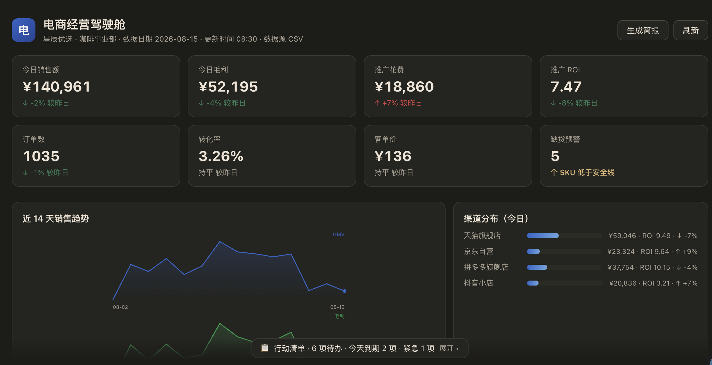
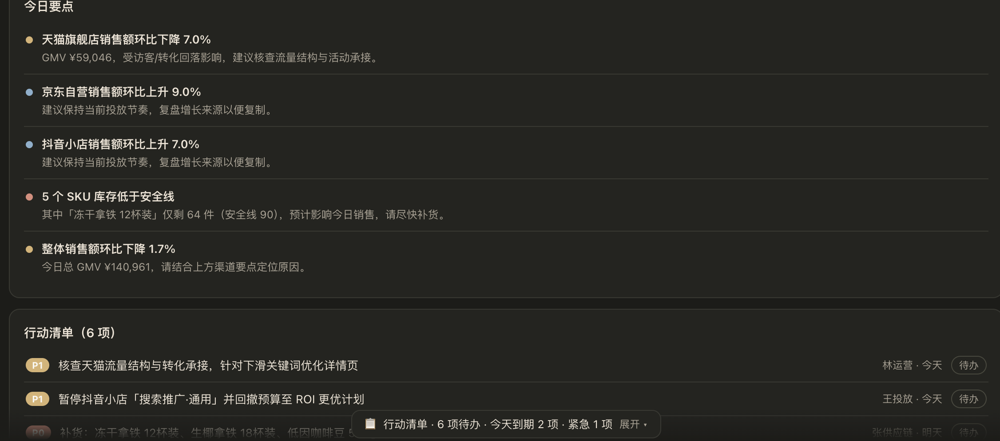
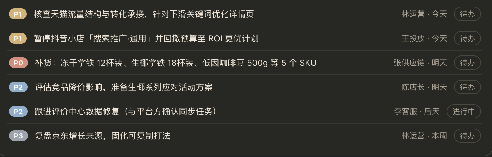
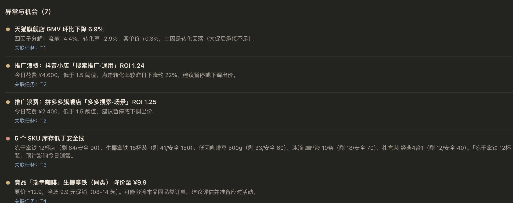
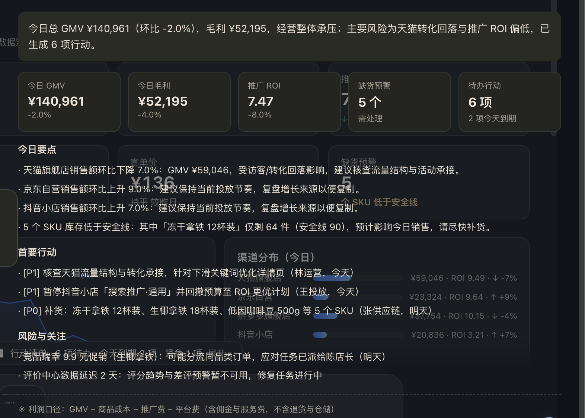

# @guannan1031/dsh-commerce-cockpit

**电商经营驾驶舱 · Ecommerce Business Cockpit** 是一个可运行的 DeepSeek Harness 插件演示。

> **演示数据｜业务日期 2026-08-15**
>
> 当前版本用于展示经营看板、数据完整性和规则式问数流程。它不连接真实电商平台，不会自动修改广告、库存、价格或订单，也不应作为真实经营决策依据。

## 你可以看到

- 经营总览：销售额、推广花费、订单、转化率、客单价和趋势
- Demo 模式下的估算经营贡献利润、模拟库存和演示行动清单
- 数据完整性、缺失字段和不可计算项
- 一页经营简报与 Markdown 导出
- `cockpit_ask` 规则式问数：趋势、渠道对比和整体投放产出比
- Imported 模式：读取指定目录中的标准 CSV，不会回退 Demo 数据

## 两种数据模式

| 模式 | 数据来源 | 可展示内容 |
| --- | --- | --- |
| Demo | 固定种子演示快照 | 演示销售、估算贡献利润、模拟库存和演示行动 |
| Imported | 用户放入指定目录的 CSV | 仅展示 CSV 实际提供且通过校验的销售、订单、访客、推广费 |

Imported 模式缺少商品成本、退款、平台费、物流或库存字段时，会显示“不可计算”或隐藏相关模块，绝不会用 Demo 数值补齐。

## 安装

发布 `0.1.2` 后，使用 DeepSeek Harness 官方插件机制安装：

```bash
dsh plugin --profile web add @guannan1031/dsh-commerce-cockpit@0.1.2
dsh plugin --profile desktop add @guannan1031/dsh-commerce-cockpit@0.1.2
```

重启对应的 Harness profile 后，在会话顶部打开“驾驶舱”入口。

## CSV 模板

点击页面“生成示例”，或使用包内 `templates/daily_sales.csv`。文件需要放在：

```text
$DSH_HOME/imports/commerce-cockpit/
```

`DSH_HOME` 未设置时使用 `~/.dsh`。文件只能通过文件名导入，不能填写任意本机路径。

最小字段为：

```text
business_date,platform,store_id,channel,gmv,orders,visitors,ad_spend
```

唯一键为 `business_date + platform + store_id + channel`。空值与真实的 `0` 不同：订单为 `0` 时客单价不可计算，访客为 `0` 时转化率不可计算，推广费为 `0` 时整体投放产出比不可计算。

文件限制：UTF-8 CSV、最大 5MB、最多 50000 行，不允许重复键、负数、非法日期、目录穿越或符号链接文件。

## 口径与边界

- Demo 的“估算经营贡献利润”是演示公式，不包含真实退款、仓储和物流口径。
- “整体投放产出比”只表示 `GMV / 推广费`，不代表广告归因 ROI。
- Imported 模式只回答有源数据支持的问题；缺少字段时会明确拒答。
- 当前没有平台 API、自动任务执行、真实库存或真实竞品监控；Demo 中的库存与竞品仅为模拟，也不处理消费者个人信息。

## 数据检查服务

面向国内代运营团队的首个服务名称为：

**7天多店日报对账与经营晨检试点**

标准检查范围为一个国内平台、最多两个店铺、最近30天、最多3份脱敏 Excel/CSV。交付数据完整性、指标对账、不可计算项和最多3条有证据的问题；问题数量和金额以实际数据为准，不保证一定发现问题。

合作联系：微信 `lijieai2025`（备注“电商经营晨检”）或邮箱 `guannan1031@gmail.com`。

## 截图











## 开发

```bash
npm test
```

演示层按 MIT License 发布；商业客户的指标口径、数据映射和定制诊断服务不属于本 Demo 的功能承诺。
